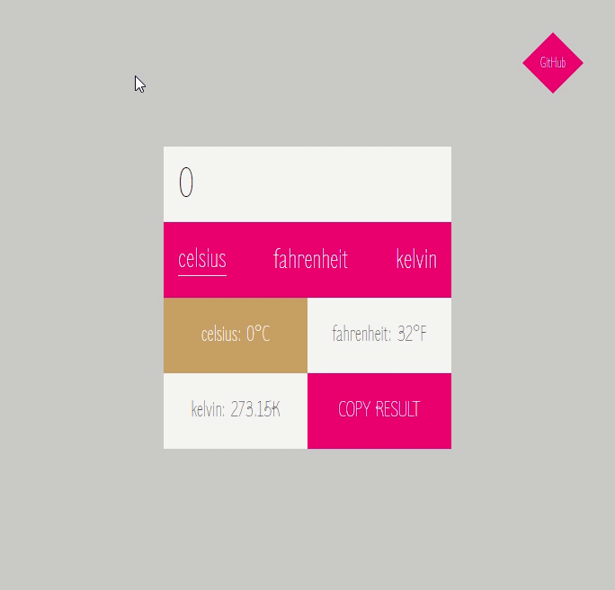

# 練習專案：溫度轉換器

專案展示：https://tzynwang.github.io/Practice_temperature-converter/

# 框架
- [Vue.js](https://vuejs.org/): v2.x

# 功能
- 可將使用者輸入的數值轉換為攝氏、華氏與克氏溫度
- 於不同單位間切換，APP會直接顯示換算後的溫度
- 可複製計算好的溫度數值

# 銘謝
- [DevProjects: Temperature converter website](https://www.codementor.io/projects/web/temperature-converter-website-atx32dy7mf)：練習題目出處
- [Elegant Pink: by Jake Hopkins](https://color.adobe.com/Elegant%20Pink-color-theme-10621958)：色票出處
- [Google Fonts: Zen Loop](https://fonts.google.com/specimen/Zen+Loop)：字體